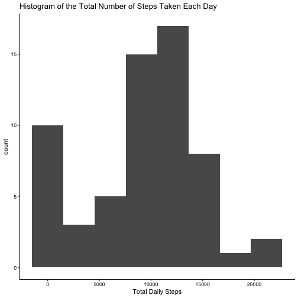
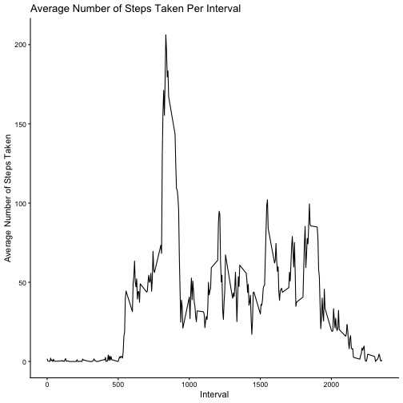
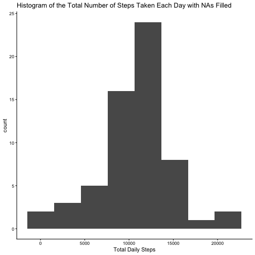
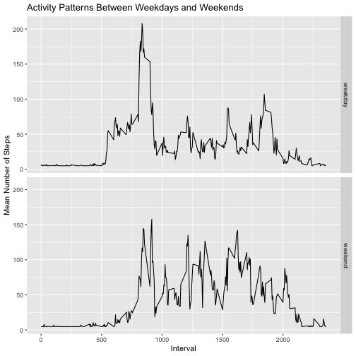

## Loading and preprocessing the data

``` r
# load relevant libraries
library(lubridate)
library(dplyr)
library(ggplot2)

# load data from disk, unzipping if necessary
zip_file <- "activity.zip"
file_name <- "activity.csv"

if (!file.exists(file_name)){
        unzip(zip_file)
}

activity_data <- read.csv(file_name, header = TRUE)

# convert dates from character vector to POSIXct vector
activity_data$date <- as.POSIXct(as.Date(activity_data$date))
```


## What is the mean total number of steps taken per day?

``` r
activity_data %>%
        group_by(date) %>%
        summarize(total_daily_steps = sum(steps, na.rm = TRUE)) %>%
        ggplot(aes(x=total_daily_steps)) +
        geom_histogram(bins = 8) +
        ggtitle("Histogram of the Total Number of Steps Taken Each Day") +
        xlab("Total Daily Steps") + 
        theme_classic()
```



``` r
daily_steps_data <- activity_data %>%
        group_by(date) %>%
        summarise(total_daily_steps = sum(steps, na.rm = TRUE))

mean_daily_steps = mean(daily_steps_data$total_daily_steps, na.rm = TRUE)
median_daily_steps = median(daily_steps_data$total_daily_steps, na.rm = TRUE)

print(paste0("Mean number of steps taken each day is ", round(mean_daily_steps)))
```

```
## [1] "Mean number of steps taken each day is 9354"
```

``` r
print(paste0("Median number of steps taken each day is ", round(median_daily_steps)))
```

```
## [1] "Median number of steps taken each day is 10395"
```


## What is the average daily activity pattern?

``` r
# compute average step per interval
average_interval_steps <- activity_data %>%
        group_by(interval) %>%
        summarize(average_steps = mean(steps, na.rm = TRUE))

# plot time series
average_interval_steps %>%
        ggplot(aes(x=interval, y=average_steps)) +
        geom_line() +
        ggtitle("Average Number of Steps Taken Per Interval") +
        xlab("Interval") + 
        ylab("Average Number of Steps Taken") +
        theme_classic()
```



``` r
# determine interval with most steps
max_interval <- with(average_interval_steps, 
                     average_interval_steps[which.max(average_steps), "interval"])

print(paste0("The 5-minute interval, on average across all the days in the dataset ",
             "that contains the maximum number of steps is interval is ",
             max_interval))
```

```
## [1] "The 5-minute interval, on average across all the days in the dataset that contains the maximum number of steps is interval is 835"
```


## Imputing missing values

``` r
print(paste0("Number of missing values in the data set: ",
             sum(is.na(activity_data))))
```

```
## [1] "Number of missing values in the data set: 2304"
```

The strategy to fill missing values is to use the mean number of steps per interval.

``` r
# compute average number of interval steps
mean_value <- mean(activity_data$steps, na.rm = TRUE)

# fill missing values
filled_activity_data <- activity_data %>%
        mutate(filled_steps = ifelse(is.na(steps), mean_value, steps),
               ) %>%
        select(-steps)

# plot histogram of filled steps
filled_activity_data %>%
        group_by(date) %>%
        summarize(total_daily_steps = sum(filled_steps)) %>%
        ggplot(aes(x=total_daily_steps)) +
        geom_histogram(bins = 8) +
        ggtitle("Histogram of the Total Number of Steps Taken Each Day with NAs Filled") +
        xlab("Total Daily Steps") + 
        theme_classic()
```



``` r
# calculate new mean and median
daily_totals <- filled_activity_data %>%
        group_by(date) %>%
        summarize(total_daily_steps = sum(filled_steps))

new_mean_daily_steps = median(daily_totals$total_daily_steps, na.rm = TRUE)                 
new_median_daily_steps = median(daily_totals$total_daily_steps, na.rm = TRUE)

print(paste0("New mean number of steps taken each day is ", round(new_mean_daily_steps)))
```

```
## [1] "New mean number of steps taken each day is 10766"
```

``` r
print(paste0("New median number of steps taken each day is ", round(new_median_daily_steps)))
```

```
## [1] "New median number of steps taken each day is 10766"
```

The new mean and median now that the missing values have been filled are greater
the previous values. Since the new mean and median have the value, it seems that
imputing the data has made the distribution more symmetrical.

## Are there differences in activity patterns between weekdays and weekends?

``` r
filled_activity_data %>%
        mutate(group = ifelse(wday(filled_activity_data$date) %in% c(1,7),
                              "weekend", 
                              "weekday"),
               ) %>%
        group_by(interval, group) %>%
        summarise(avg_num_steps = mean(filled_steps),
                  ) %>%
        ungroup() %>%
        ggplot(aes(x = interval, y = avg_num_steps)) +
        geom_line() + 
        facet_grid(group ~ .) +
        xlab("Interval") + 
        ylab("Mean Number of Steps") +
        ggtitle("Activity Patterns Between Weekdays and Weekends")
```

```
## `summarise()` has grouped output by 'interval'. You can override using the `.groups` argument.
```



The patterns of the average number of steps take on weekdays versus those taken
on weekend are different.
